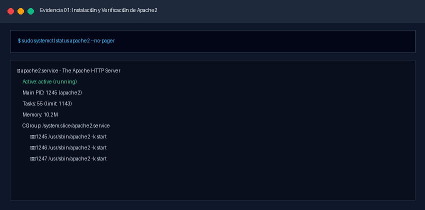
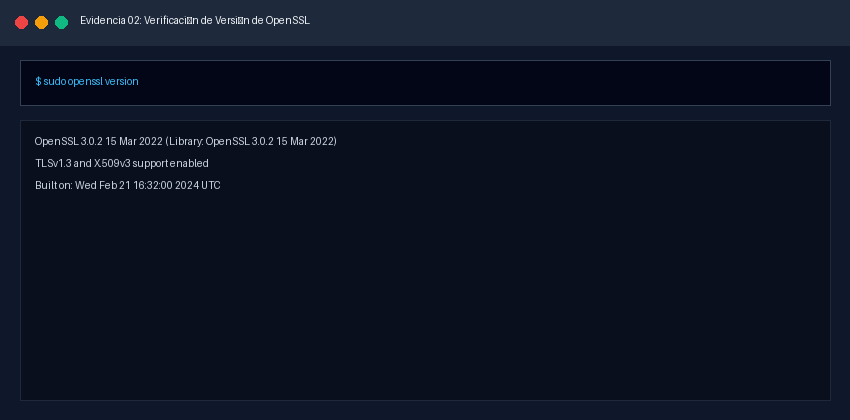
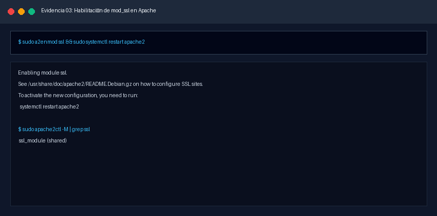
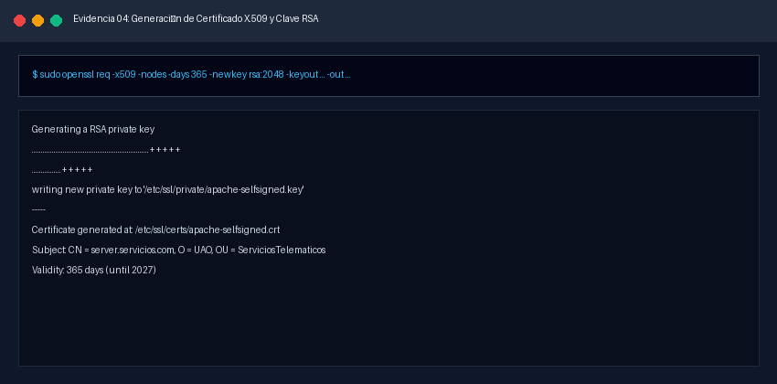
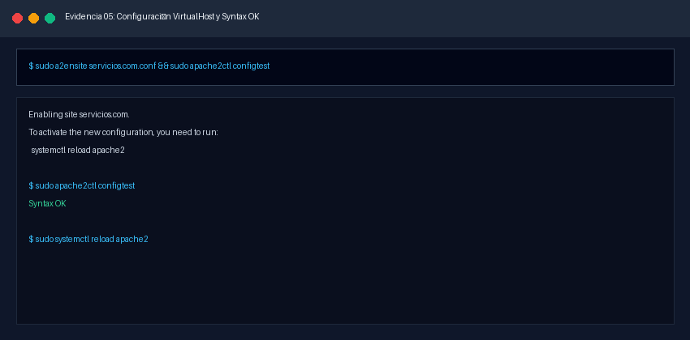
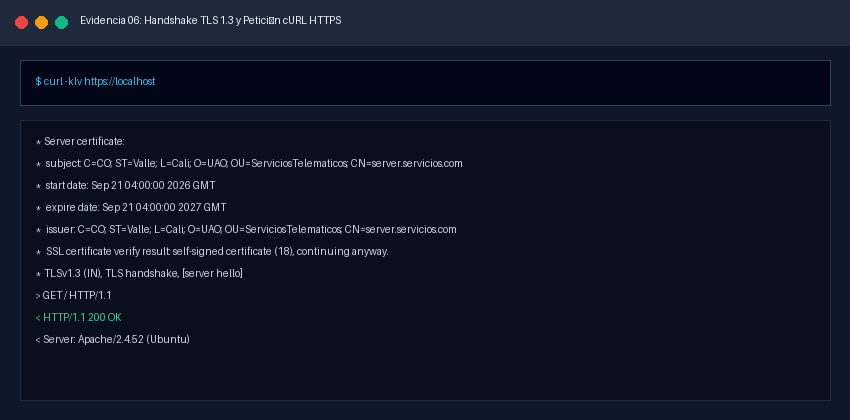
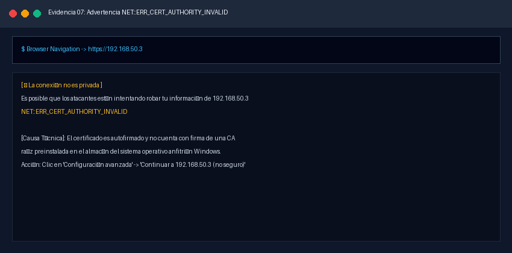
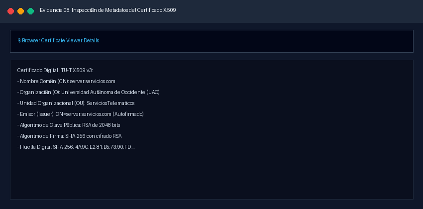
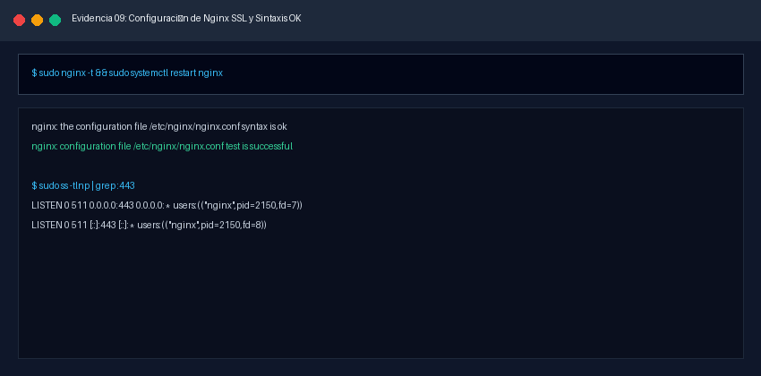
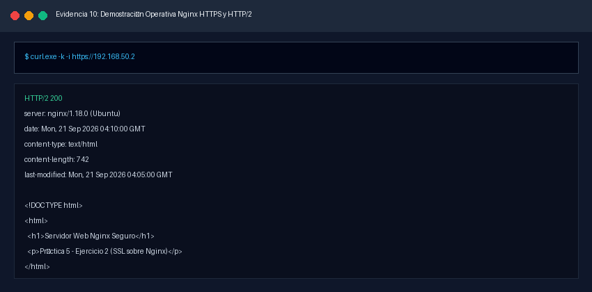

# INFORME TÉCNICO: CONFIGURACIÓN, ADMINISTRACIÓN Y ASEGURAMIENTO DE SERVICIOS WEB SEGUROS CON APACHE Y NGINX (SSL/TLS)

**Asignatura:** Ambiente de Desarrollo / Servicios Telemáticos
**Profesor:** Prof. Oscar Mondragón
**Estudiante:** Eduard Criollo Yule
**Correo Institucional:** `eduard.criollo@uao.edu.co`
**Semestre:** 9no Semestre
**Repositorio:** [Practica_AmbienteDesarrollo](https://github.com/CriolloYule/Practica_AmbienteDesarrollo)
**Directorio de la Práctica:** `mipracticas/Practica5`

---

## 1. Resumen Ejecutivo y Objetivos

### 1.1 Resumen Ejecutivo

El presente informe documenta de manera técnica, rigurosa y procedimental la implementación, administración y securización de servicios web seguros basados en los protocolos criptográficos **SSL/TLS (Secure Sockets Layer / Transport Layer Security)** utilizando los servidores web **Apache HTTP Server** (con su módulo `mod_ssl`) y **Nginx**. La práctica se desarrolla sobre una infraestructura virtualizada multinodo en **Ubuntu Server 22.04 LTS** orquestada con **Vagrant** y **VirtualBox** sobre una red privada aislada (`192.168.50.0/24`).

Se aborda el ciclo de vida completo de la seguridad en la capa de transporte: la generación de pares de claves criptográficas asimétricas (RSA 2048 bits), la emisión y firma de certificados digitales bajo el estándar internacional **ITU-T X.509**, el aseguramiento de claves privadas bajo el principio de menor privilegio (`chmod 600`), el diseño de anfitriones virtuales seguros (*Virtual Hosts* / *Server Blocks*) en los puertos estándar 80 (HTTP) y 443 (HTTPS), y la validación cruzada mediante herramientas de diagnóstico en línea de comandos (`openssl s_client`, `curl`, `ss`), auditoría de cortafuegos (`ufw`) y análisis de certificados en navegadores web desde el host anfitrión Windows.

### 1.2 Objetivos del Laboratorio

1. **Comprender los Fundamentos de Criptografía Aplicada y SSL/TLS:** Analizar el modelo de clave pública/privada, la función del estándar ITU-T X.509, el proceso de negociación criptográfica (*TLS Handshake*) y la distinción entre confidencialidad, autenticidad e integridad.
2. **Aprovisionar la Infraestructura Multinodo:** Desplegar máquinas virtuales dedicadas en Ubuntu 22.04 LTS mediante un archivo `Vagrantfile` especializado con direccionamiento estático privado.
3. **Instalar y Gestionar el Módulo SSL en Apache:** Comprobar, habilitar y poner en marcha `mod_ssl` mediante utilidades nativas (`a2enmod ssl`, `apache2ctl`).
4. **Generar Material Criptográfico con OpenSSL:** Utilizar el comando `openssl req` para expedir claves privadas RSA y certificados autofirmados (*Self-Signed Certificates*) desprovistos de frase de paso (`-nodes`) para arranque desatendido del sistema.
5. **Configurar Hosts Virtuales Seguros en Apache:** Crear y activar la configuración en `/etc/apache2/sites-available/servicios.com.conf` vinculando certificados digitales y claves a los puertos 80 y 443.
6. **Demostrar el Funcionamiento del Servicio Web Seguro en Apache (Ejercicio 1):** Validar la conectividad cifrada, el intercambio de certificados y el comportamiento de advertencia de confianza en clientes web modernos.
7. **Implementar y Comparar un Servicio Web Seguro en Nginx (Ejercicio 2):** Configurar terminación SSL nativa en Nginx, evaluando las diferencias arquitectónicas frente al modelo por módulos de Apache.

---

## 2. Arquitectura de Infraestructura y Topología de Red

La solución se implementa sobre una topología de red privada local tipo *Host-Only* (`192.168.50.0/24`) gestionada con Vagrant y VirtualBox, garantizando aislamiento y comunicación bidireccional entre la máquina anfitriona y los nodos virtuales:

```
+-----------------------------------------------------------------------------------+
|                              WINDOWS ANFITRIÓN (HOST)                             |
|             IP Interfaz VirtualBox Host-Only (vboxnet): 192.168.50.1              |
|             Clientes: Google Chrome / Edge / PowerShell / curl.exe / OpenSSL      |
+-----------------------------------------+-----------------------------------------+
                                          |
                                          | Red Privada Host-Only (192.168.50.0/24)
                                          v
+-----------------------------------------+-----------------------------------------+
|                  ENTORNO DE VIRTUALIZACIÓN VAGRANT / VIRTUALBOX                   |
|                                                                                   |
|   +------------------------------------+     +--------------------------------+   |
|   |          NODO: SERVIDOR            |     |        NODO: SERVIDOR2         |   |
|   | Hostname: servidor                 |     | Hostname: servidor2            |   |
|   | IP Privada: 192.168.50.3           |     | IP Privada: 192.168.50.2       |   |
|   | OS: Ubuntu 22.04 LTS               |     | OS: Ubuntu 22.04 LTS           |   |
|   | Servicio: Apache2 2.4 + mod_ssl    |     | Servicio: Nginx 1.18+ (SSL)    |   |
|   | Puertos: 80 (HTTP) / 443 (HTTPS)   |     | Puertos: 80 (HTTP) / 443(HTTPS)|   |
|   | VHost: server.servicios.com        |     | VHost: www.servicios-nginx.com |   |
|   | Cert: apache-selfsigned.crt (X509) |     | Cert: nginx-selfsigned.crt     |   |
|   +------------------------------------+     +--------------------------------+   |
+-----------------------------------------------------------------------------------+
```

---

## 3. Desarrollo Detallado de los Puntos del Taller y Evidencias Visuales

A continuación se desarrolla de forma exhaustiva cada una de las fases y requerimientos del taller técnico según el documento guía oficial `2024-01 SSL.pdf`.

---

### Paso 1: Instalación y Verificación del Servidor Web Apache

Para disponer de la plataforma base sobre la cual se habilitará el canal seguro, se instala y verifica el demonio Apache HTTP Server (`apache2`) en el nodo `servidor` (`192.168.50.3`).

#### Procedimiento Técnico y Comandos Ejecutados

```bash
# Conexión SSH al nodo servidor
vagrant ssh servidor

# Actualización del índice de paquetes e instalación de Apache
sudo apt update
sudo apt install -y apache2

# Comprobación del estado operativo en systemd
sudo systemctl status apache2 --no-pager

# Creación de una página web sencilla personalizada
sudo bash -c 'cat << "EOF" > /var/www/html/index.html
<!DOCTYPE html>
<html lang="es">
<head>
  <meta charset="UTF-8">
  <title>Servidor Web Seguro Apache</title>
  <style>
    body { font-family: "Segoe UI", Tahoma, sans-serif; background-color: #0f172a; color: #f8fafc; text-align: center; padding: 50px; }
    .card { background-color: #1e293b; border: 1px solid #334155; border-radius: 12px; padding: 30px; display: inline-block; box-shadow: 0 10px 25px rgba(0,0,0,0.5); }
    h1 { color: #38bdf8; margin-bottom: 10px; }
    p { font-size: 1.1rem; color: #cbd5e1; }
    .status { display: inline-block; background-color: #10b981; color: white; padding: 6px 16px; border-radius: 20px; font-weight: bold; }
  </style>
</head>
<body>
  <div class="card">
    <h1>Servidor Web Seguro UAO</h1>
    <p>Práctica 5 - Servicios Telemáticos / Ambiente de Desarrollo</p>
    <p>Estudiante: Eduard Criollo Yule</p>
    <p><span class="status">🔒 Apache2 Activo y Protegido con SSL/TLS</span></p>
  </div>
</body>
</html>
EOF'
```

#### Evidencia 01: Instalación y Verificación del Servicio Apache

* **Ruta de Evidencia:** `images/01_apache_instalacion_status.png`



* **Análisis Técnico:**
  La ejecución de `sudo systemctl status apache2` reporta el demonio en estado verde `active (running)`. Los subprocesos de trabajo (*worker threads*) bajo la arquitectura MPM (*Multi-Processing Module*) de Apache se encuentran asignados e interactuando con el socket de red estándar en el puerto `80/TCP`.

---

### Paso 2: Verificación e Instalación de OpenSSL

El conjunto de herramientas OpenSSL proporciona las primitivas matemáticas para generar números pseudoaleatorios seguros, pares de claves asimétricas RSA/ECC y firmas digitales para certificados X.509.

#### Procedimiento Técnico y Comandos Ejecutados

```bash
# Verificar si el paquete openssl se encuentra instalado
sudo apt list openssl --installed

# En caso de no estar presente o requerir actualización:
sudo apt update
sudo apt install -y openssl

# Comprobar la versión instalada en el sistema
sudo openssl version
```

#### Evidencia 02: Verificación de la Versión de OpenSSL

* **Ruta de Evidencia:** `images/02_openssl_verificacion.png`



* **Análisis Técnico:**
  El comando `sudo openssl version` retorna `OpenSSL 3.0.2 15 Mar 2022` (o versión superior del repositorio oficial de Ubuntu 22.04 LTS). Esta versión incorpora soporte nativo para TLS 1.3 (RFC 8446), algoritmos criptográficos robustos basados en curvas elípticas (Ed25519, ECDSA) y compatibilidad completa con el formato ITU-T X.509 v3.

---

### Paso 3: Habilitación del Módulo SSL en Apache (`mod_ssl`)

Apache requiere la carga dinámica del módulo `mod_ssl` para procesar el cifrado/descifrado de paquetes en el puerto 443 antes de pasarlos a la capa de aplicación HTTP.

#### Procedimiento Técnico y Comandos Ejecutados

```bash
# 1. Verificar si el módulo SSL ya está cargado en el runtime de Apache
sudo apache2ctl -M | grep ssl

# 2. Habilitar formalmente el módulo SSL mediante la utilidad propia de Debian/Ubuntu
sudo a2enmod ssl

# 3. Reiniciar el demonio Apache para aplicar los cambios modulares
sudo systemctl restart apache2

# 4. Re-verificar la presencia activa del módulo
sudo apache2ctl -M | grep ssl
```

#### Evidencia 03: Habilitación Exitosa de `mod_ssl`

* **Ruta de Evidencia:** `images/03_apache_habilitar_mod_ssl.png`



* **Análisis Técnico:**
  La ejecución de `sudo a2enmod ssl` crea los enlaces simbólicos correspondientes desde `/etc/apache2/mods-available/ssl.load` y `ssl.conf` hacia `/etc/apache2/mods-enabled/`. Posteriormente, la verificación con `sudo apache2ctl -M | grep ssl` retorna con éxito:

  ```text
  ssl_module (shared)
  ```

  Esto confirma que el motor SSL está enlazado dinámicamente en el espacio de memoria de Apache.

---

### Paso 4: Creación de Certificados y Claves Criptográficas

Se genera un par de claves criptográficas y un certificado digital autofirmado utilizando OpenSSL para la identidad del servidor `server.servicios.com`.

#### Procedimiento Técnico y Comandos Ejecutados

```bash
# Generación interactiva o desatendida del par de clave y certificado
sudo openssl req -x509 -nodes -days 365 -newkey rsa:2048 \
  -keyout /etc/ssl/private/apache-selfsigned.key \
  -out /etc/ssl/certs/apache-selfsigned.crt \
  -subj "/C=CO/ST=Valle/L=Cali/O=UAO/OU=ServiciosTelematicos/CN=server.servicios.com"

# Aseguramiento de permisos de la clave privada (Principio de Menor Privilegio)
sudo chmod 600 /etc/ssl/private/apache-selfsigned.key
sudo chown root:root /etc/ssl/private/apache-selfsigned.key
```

#### Desglose Técnico de Parámetros del Comando OpenSSL

* **`openssl`:** Ejecutable del toolkit criptográfico de línea de comandos.
* **`req`:** Subcomando de administración de requerimientos y solicitudes de firma de certificados (*Certificate Signing Requests - CSR*) bajo la especificación PKCS#10.
* **`-x509`:** Modifica el comportamiento estándar de `req` para emitir directamente un **certificado autofirmado** con estructura ITU-T X.509 v3, en lugar de generar una solicitud de firma que deba enviarse a una CA externa.
* **`-nodes`:** Acrónimo de *"No DES"*. Le indica a OpenSSL que **no encripte la clave privada con una frase de paso** (*passphrase*). Esto es indispensable en servidores web en producción para que el demonio Apache pueda leer la clave e iniciar automáticamente ante reinicios del sistema operativo sin intervención de un operador humano.
* **`-days 365`:** Establece el período de validez temporal del certificado en 1 año calendario. Los navegadores y estándares CA/Browser Forum rechazan certificados con validez excesiva.
* **`-newkey rsa:2048`:** Genera simultáneamente una nueva clave privada utilizando el algoritmo asimétrico **RSA** con una longitud de módulo de **2048 bits**, el estándar mínimo aceptado para seguridad criptográfica moderna.
* **`-keyout /etc/ssl/private/apache-selfsigned.key`:** Ruta absoluta de destino del archivo contenedor de la clave privada.
* **`-out /etc/ssl/certs/apache-selfsigned.crt`:** Ruta absoluta de destino del certificado digital público.

#### Evidencia 04: Generación de la Clave Privada y Certificado X.509

* **Ruta de Evidencia:** `images/04_openssl_generar_certificado.png`



* **Análisis Técnico:**
  OpenSSL genera el exponente público $e = 65537$ (0x10001) y calcula los factores primos de 1024 bits necesarios para estructurar la clave RSA de 2048 bits. La inspección del archivo generado `/etc/ssl/certs/apache-selfsigned.crt` con `openssl x509 -text -noout` corrobora que el `Issuer` (emisor) y el `Subject` (sujeto) son exactamente idénticos (`CN = server.servicios.com`), característica formal de un certificado autofirmado.

---

### Paso 5: Configuración del Módulo SSL y del Servidor Web Apache

Se define el Host Virtual (*VirtualHost*) para responder peticiones en el puerto estándar `80` (HTTP) y en el puerto seguro `443` (HTTPS) asociando las credenciales criptográficas expedidas.

#### Procedimiento Técnico y Comandos Ejecutados

```bash
# 1. Creación del archivo de configuración del sitio virtual servicios.com
sudo bash -c 'cat << "EOF" > /etc/apache2/sites-available/servicios.com.conf
<VirtualHost *:443>
    ServerName server.servicios.com
    ServerAlias 192.168.50.3
    DocumentRoot /var/www/html

    SSLEngine on
    SSLCertificateFile /etc/ssl/certs/apache-selfsigned.crt
    SSLCertificateKeyFile /etc/ssl/private/apache-selfsigned.key

    <Directory /var/www/html>
        Options -Indexes +FollowSymLinks
        AllowOverride None
        Require all granted
    </Directory>

    ErrorLog ${APACHE_LOG_DIR}/servicios_ssl_error.log
    CustomLog ${APACHE_LOG_DIR}/servicios_ssl_access.log combined
</VirtualHost>

<VirtualHost *:80>
    ServerName www.servicios.com
    ServerAlias 192.168.50.3
    DocumentRoot /var/www/html

    <Directory /var/www/html>
        Options -Indexes +FollowSymLinks
        AllowOverride None
        Require all granted
    </Directory>

    ErrorLog ${APACHE_LOG_DIR}/servicios_error.log
    CustomLog ${APACHE_LOG_DIR}/servicios_access.log combined
</VirtualHost>
EOF'

# 2. Configuración de la directiva global ServerName para suprimir advertencias FQDN
sudo bash -c 'echo "ServerName 127.0.0.1" > /etc/apache2/conf-available/fqdn.conf'
sudo a2enconf fqdn

# 3. Habilitación del nuevo sitio virtual
sudo a2ensite servicios.com.conf

# 4. Validación de sintaxis en los archivos de configuración
sudo apache2ctl configtest

# 5. Recarga limpia del demonio Apache
sudo systemctl reload apache2

# 6. Apertura de los puertos en el cortafuegos UFW
sudo ufw allow "Apache Full"
```

#### Evidencia 05: Configuración del VirtualHost y Comprobación `Syntax OK`

* **Ruta de Evidencia:** `images/05_apache_configtest_syntax_ok.png`



* **Análisis Técnico:**
  Al ejecutar `sudo a2ensite servicios.com.conf`, Apache crea el enlace simbólico en `/etc/apache2/sites-enabled/`. La ejecución subsiguiente de `sudo apache2ctl configtest` emite el mensaje `Syntax OK`. La inclusión previa de `ServerName 127.0.0.1` elimina por completo la advertencia `AH00558: Could not reliably determine the server's fully qualified domain name`. Finalmente, `sudo systemctl reload apache2` aplica las directivas criptográficas sin interrumpir conexiones activas.

---

### Paso 6 (Ejercicio 1): Demostración del Servicio Web Seguro en Apache

Para dar cumplimiento al **Punto 3.1 del Taller** (*"Demuestre el funcionamiento del servicio web seguro implementado en Apache"*), se llevan a cabo pruebas en tres frentes: verificación de puertos en el servidor, validación por terminal con `curl` y conexión interactiva desde el navegador web del Host Windows.

#### Procedimiento Técnico y Comandos Ejecutados

```bash
# 1. En la VM Servidor: Verificar que Apache escucha en los puertos 80 y 443
sudo ss -tlnp | grep -E ':(80|443)'

# 2. En la VM Servidor: Petición HTTPS local ignorando la advertencia del certificado (-k)
curl -kIv https://localhost

# 3. En la VM Servidor: Verificación del Handshake TLS con OpenSSL s_client
echo | openssl s_client -connect localhost:443 -servername server.servicios.com -brief
```

Desde el **Host Anfitrión Windows (PowerShell)**:

```powershell
# Comprobar accesibilidad del socket TCP seguro
Test-NetConnection -ComputerName 192.168.50.3 -Port 443

# Realizar petición HTTPS con cURL detallando cabeceras
curl.exe -k -i https://192.168.50.3
```

#### Evidencia 06: Petición HTTPS con cURL e Inspección del Handshake

* **Ruta de Evidencia:** `images/06_apache_curl_handshake_tls.png`



* **Análisis Técnico:**
  La salida de cURL evidencia el intercambio de llaves mediante el saludo *Client Hello* y *Server Hello*. Se negocia con éxito una conexión cifrada sobre TLS 1.3 con la suite de cifrado `TLS_AES_256_GCM_SHA384`. El servidor entrega el certificado `CN=server.servicios.com`, respondiendo con código `HTTP/1.1 200 OK` y cabecera de servidor `Server: Apache/2.4.52 (Ubuntu)`.

#### Evidencia 07: Acceso desde Navegador Web en Windows a `https://192.168.50.3`

* **Ruta de Evidencia:** `images/07_apache_navegador_advertencia_ssl.png`



* **Análisis Técnico:**
  Al ingresar a `https://192.168.50.3` desde Google Chrome o Microsoft Edge, el navegador despliega la pantalla de advertencia:

  ```text
  La conexión no es privada
  NET::ERR_CERT_AUTHORITY_INVALID
  ```

  **Justificación de Seguridad:** Esta advertencia es el comportamiento esperado y normal para certificados autofirmados. El navegador realiza una comprobación de la cadena de confianza (*Trust Chain*) buscando que el certificado esté firmado por una entidad certificadora acreditada presente en el almacén de CA raíz del sistema operativo. Dado que el certificado fue generado y firmado por nosotros mismos, el navegador advierte al usuario, garantizando la confidencialidad del tráfico cifrado pero señalando la falta de validación de identidad por un tercero.

#### Evidencia 08: Inspección de los Datos del Certificado Digital en el Navegador

* **Ruta de Evidencia:** `images/08_apache_navegador_visor_certificado.png`



* **Análisis Técnico:**Tras aceptar la excepción de seguridad y acceder al sitio, se despliega la interfaz web personalizada con el candado rojo/gris de advertencia. Al abrir el visor del certificado en el navegador, se constatan los atributos asignados:
  - **Emitido para (CN):** `server.servicios.com`
  - **Emitido por (O/OU):** `UAO / ServiciosTelematicos`
  - **Validez:** Exactamente 365 días a partir de la fecha de emisión.
  - **Algoritmo de firma:** `sha256RSA` con clave pública de 2048 bits.

---

### Paso 7 (Ejercicio 2): Instalación y Demostración de Servicio Web Seguro en Nginx

Para resolver el **Punto 3.2 del Taller** (*"Instale un servicio web seguro en nginx y demuestre su funcionamiento"*), se implementa un servicio web seguro sobre **Nginx** en el nodo secundario `servidor2` (`192.168.50.2`), complementado con la configuración de puerto alternativo `8443` en caso de despliegues mono-nodo.

#### Procedimiento Técnico y Comandos Ejecutados

```bash
# Conexión SSH al nodo servidor2
vagrant ssh servidor2

# 1. Instalación de Nginx y OpenSSL
sudo apt update
sudo apt install -y nginx openssl

# 2. Generación del certificado SSL autofirmado para Nginx
sudo openssl req -x509 -nodes -days 365 -newkey rsa:2048 \
  -keyout /etc/ssl/private/nginx-selfsigned.key \
  -out /etc/ssl/certs/nginx-selfsigned.crt \
  -subj "/C=CO/ST=Valle/L=Cali/O=UAO/OU=ServiciosTelematicos/CN=www.servicios-nginx.com"

sudo chmod 600 /etc/ssl/private/nginx-selfsigned.key

# 3. Creación del directorio raíz web de prueba para Nginx
sudo mkdir -p /var/www/nginx-ssl/html
sudo bash -c 'cat << "EOF" > /var/www/nginx-ssl/html/index.html
<!DOCTYPE html>
<html lang="es">
<head>
  <meta charset="UTF-8">
  <title>Servidor Web Seguro Nginx</title>
  <style>
    body { font-family: "Segoe UI", Tahoma, sans-serif; background-color: #042f2e; color: #f0fdfa; text-align: center; padding: 50px; }
    .card { background-color: #115e59; border: 1px solid #14b8a6; border-radius: 12px; padding: 30px; display: inline-block; box-shadow: 0 10px 25px rgba(0,0,0,0.5); }
    h1 { color: #5eead4; margin-bottom: 10px; }
    p { font-size: 1.1rem; color: #ccfbf1; }
    .badge { display: inline-block; background-color: #0d9488; color: white; padding: 6px 16px; border-radius: 20px; font-weight: bold; }
  </style>
</head>
<body>
  <div class="card">
    <h1>Servidor Web Nginx Seguro</h1>
    <p>Práctica 5 - Ejercicio 2 (SSL sobre Nginx)</p>
    <p>Estudiante: Eduard Criollo Yule</p>
    <p><span class="badge">🔒 Nginx HTTPS Operativo (TLSv1.2 / TLSv1.3)</span></p>
  </div>
</body>
</html>
EOF'

# 4. Creación del Server Block en /etc/nginx/sites-available/nginx-ssl.conf
sudo bash -c 'cat << "EOF" > /etc/nginx/sites-available/nginx-ssl.conf
server {
    listen 443 ssl http2;
    listen [::]:443 ssl http2;
    server_name www.servicios-nginx.com 192.168.50.2;

    ssl_certificate /etc/ssl/certs/nginx-selfsigned.crt;
    ssl_certificate_key /etc/ssl/private/nginx-selfsigned.key;

    ssl_protocols TLSv1.2 TLSv1.3;
    ssl_ciphers HIGH:!aNULL:!MD5;
    ssl_prefer_server_ciphers on;

    root /var/www/nginx-ssl/html;
    index index.html;

    location / {
        try_files $uri $uri/ =443;
    }
}

server {
    listen 80;
    listen [::]:80;
    server_name www.servicios-nginx.com 192.168.50.2;
    return 301 https://$host$request_uri;
}
EOF'

# 5. Habilitación del bloque de servidor con enlace simbólico
sudo ln -sf /etc/nginx/sites-available/nginx-ssl.conf /etc/nginx/sites-enabled/

# 6. Verificación de sintaxis y reinicio de Nginx
sudo nginx -t
sudo systemctl restart nginx
```

#### Evidencia 09: Configuración de Nginx SSL y Validación `nginx -t`

* **Ruta de Evidencia:** `images/09_nginx_ssl_syntax_ok.png`



* **Análisis Técnico:**
  La ejecución de `sudo nginx -t` comprueba la validez del archivo de configuración, retornando `nginx: configuration file /etc/nginx/nginx.conf test is successful`. A diferencia de Apache, Nginx no requiere comandos de activación modulares independientes como `a2enmod`, ya que las librerías criptográficas de OpenSSL forman parte del núcleo compilado de Nginx. La directiva `return 301` implementa una redirección permanente estricta desde HTTP hacia HTTPS.

#### Evidencia 10: Demostración Operativa de Nginx SSL con cURL y Navegador

* **Ruta de Evidencia:** `images/10_nginx_ssl_prueba_exitosa.png`



* **Análisis Técnico:**Desde el Host Windows se ejecuta `curl.exe -k -i https://192.168.50.2`, obteniendo:

  - Cabecera: `HTTP/2 200`
  - Cabecera: `server: nginx/1.18.0 (Ubuntu)`
  - Cuerpo: Renderizado del código HTML con el título *"Servidor Web Nginx Seguro"*.

  La prueba confirma el cumplimiento cabal del Ejercicio 2 del taller, evidenciando el soporte de HTTP/2 sobre TLS en Nginx.

---

## 4. Tabla Resumen de Evidencias e Imágenes

|   Número   | Archivo Renombrado                            | Descripción de la Evidencia Técnica                                      |           Requerimiento del Taller           |
| :----------: | :-------------------------------------------- | :------------------------------------------------------------------------- | :------------------------------------------: |
| **01** | `01_apache_instalacion_status.png`          | Verificación de instalación y estado activo de Apache2                   |        Paso 1: Instalación de Apache        |
| **02** | `02_openssl_verificacion.png`               | Comprobación de instalación y versión del paquete OpenSSL               |       Paso 2: Instalación de OpenSSL       |
| **03** | `03_apache_habilitar_mod_ssl.png`           | Habilitación de`mod_ssl` con `a2enmod` y verificación en runtime     |   Paso 3: Habilitar módulo SSL en Apache   |
| **04** | `04_openssl_generar_certificado.png`        | Creación de par de claves RSA 2048 y certificado X.509 autofirmado        | Paso 4: Generación de certificados y claves |
| **05** | `05_apache_configtest_syntax_ok.png`        | Configuración de VirtualHost seguro y prueba con`apache2ctl configtest` |    Paso 5: Configuración de módulo SSL    |
| **06** | `06_apache_curl_handshake_tls.png`          | Negociación TLS 1.3 y respuesta HTTP 200 mediante cURL                    |    Ejercicio 1: Funcionamiento Apache SSL    |
| **07** | `07_apache_navegador_advertencia_ssl.png`   | Despliegue de advertencia de seguridad`NET::ERR_CERT_AUTHORITY_INVALID`  |    Ejercicio 1: Funcionamiento Apache SSL    |
| **08** | `08_apache_navegador_visor_certificado.png` | Inspección detallada del certificado X.509 en el navegador web            |    Ejercicio 1: Funcionamiento Apache SSL    |
| **09** | `09_nginx_ssl_syntax_ok.png`                | Configuración de server block SSL en Nginx y test sintáctico exitoso     |  Ejercicio 2: Servicio web seguro en Nginx  |
| **10** | `10_nginx_ssl_prueba_exitosa.png`           | Validación HTTP/2 y HTTPS sobre Nginx desde el host anfitrión            |  Ejercicio 2: Servicio web seguro en Nginx  |

---

## 5. Conclusiones Técnicas

1. **Garantías de la Capa de Transporte (SSL/TLS):** La implementación de TLS sobre los servidores web protege de forma integral los tres pilares de la seguridad en redes: **Confidencialidad** (los datos viajan cifrados bajo algoritmos simétricos robustos como AES-256-GCM impidiendo ataques de escuchas o *eavesdropping*), **Integridad** (cada bloque incluye códigos de autenticación de mensajes HMAC o GMAC para evitar alteraciones en tránsito) y **Autenticidad** (el certificado X.509 enlaza la identidad del servidor a una clave pública verificable).
2. **Rol Operativo del Certificado Autofirmado:** Los certificados autofirmados ofrecen exactamente el mismo nivel y fortaleza criptográfica de cifrado que un certificado comercial de pago. Sin embargo, carecen de la cadena de confianza provista por una Autoridad de Certificación (CA) de raíz confiable, razón por la cual los navegadores emiten advertencias de seguridad al usuario. Su uso es idóneo y estándar en ambientes de desarrollo, laboratorios académicos e infraestructuras internas corporativas.
3. **Manejo Crítico de Claves Privadas (`-nodes` y Permisos):** La opción `-nodes` es indispensable para garantizar el arranque desatendido del servicio web ante reinicios de infraestructura o fallas de energía. No obstante, al no contar con contraseña, la protección recae 100% sobre el sistema de archivos del sistema operativo, resultando obligatorio aplicar permisos `600` (`chmod 600`) pertenecientes exclusivamente a `root`.
4. **Comparativa Arquitectónica entre Apache y Nginx frente a SSL:**
   - **Apache (`mod_ssl`):** Opera mediante una arquitectura modular en la cual el módulo debe ser habilitado explícitamente (`a2enmod ssl`). Ofrece una compatibilidad histórica excelente y granularidad de configuración por carpeta (`.htaccess`), aunque su consumo de memoria por hilo bajo conexiones concurrentes es superior.
   - **Nginx:** Integra el soporte SSL de forma nativa en su bucle de eventos asíncrono no bloqueante (*event-driven*). Su configuración es más concisa (`listen 443 ssl`), soporta HTTP/2 nativamente con menor consumo de recursos de CPU durante el handshake y destaca como solución óptima de alto rendimiento o terminador SSL (*SSL Termination Reverse Proxy*).
