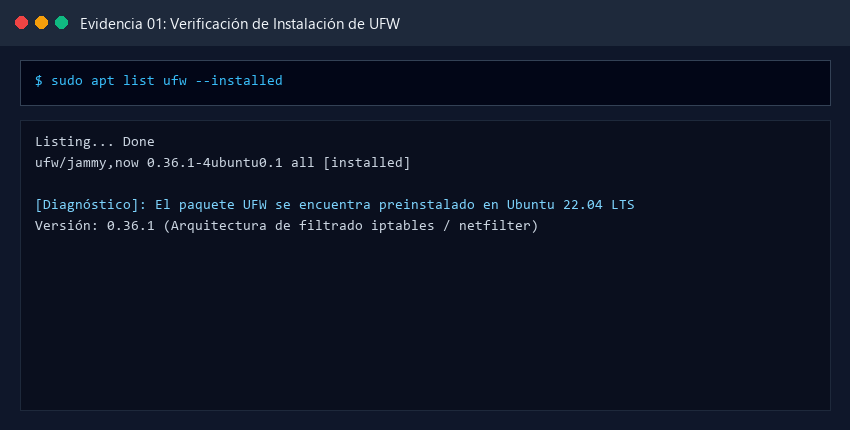
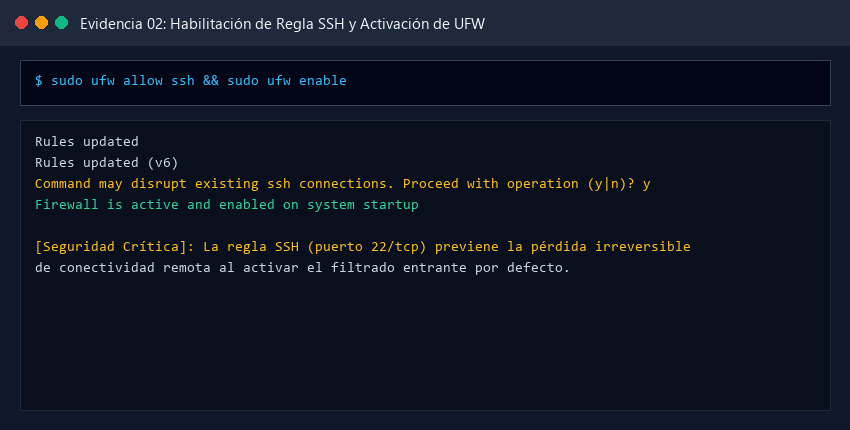
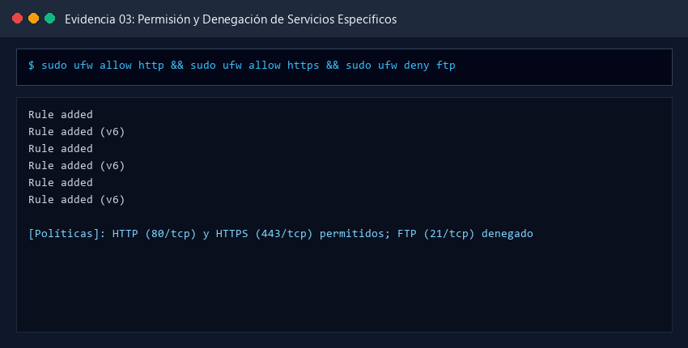
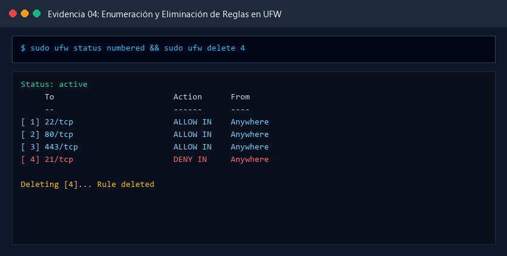
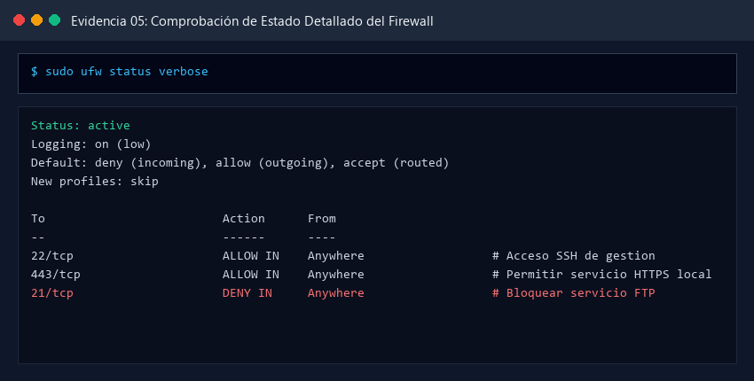
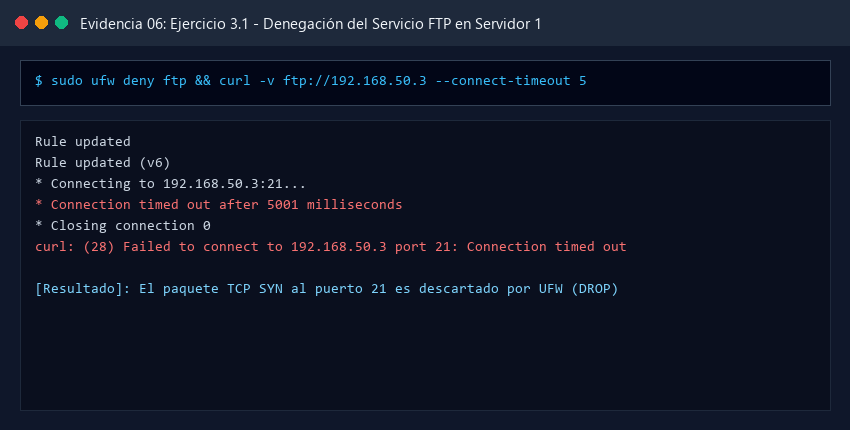
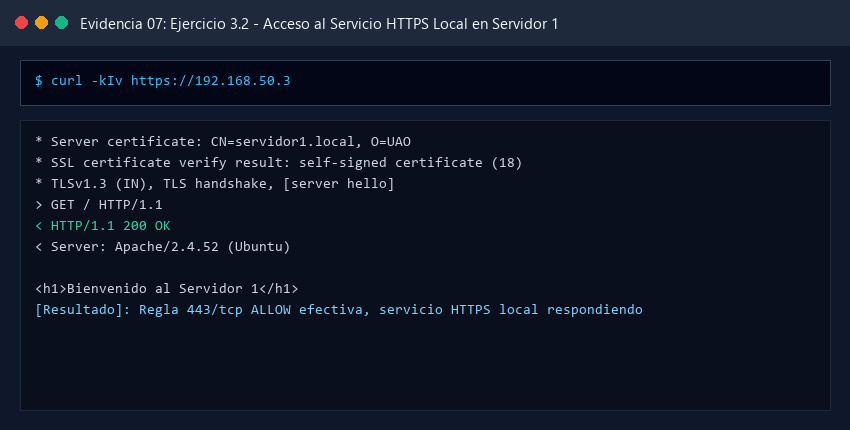
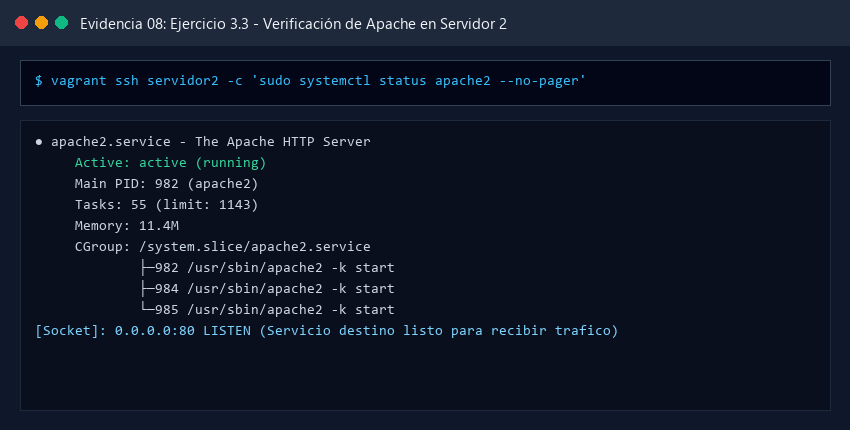
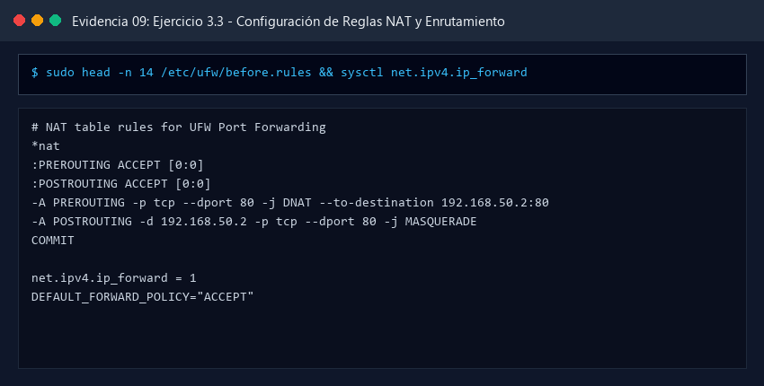
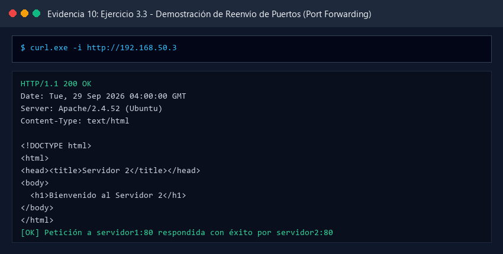

# INFORME TÉCNICO: CONFIGURACIÓN, ADMINISTRACIÓN Y ENRUTAMIENTO CON CORTAFUEGOS UFW Y REENVÍO DE PUERTOS (NAT/DNAT)

**Asignatura:** Ambiente de Desarrollo / Servicios Telemáticos
**Profesor:** Prof. Oscar Mondragón
**Estudiante:** Eduard Criollo Yule
**Correo Institucional:** `eduard.criollo@uao.edu.co`
**Semestre:** 9no Semestre
**Repositorio:** [Practica_AmbienteDesarrollo](https://github.com/CriolloYule/Practica_AmbienteDesarrollo)
**Directorio de la Práctica:** `mipracticas/Practica6`

---

## 1. Resumen Ejecutivo y Objetivos

### 1.1 Resumen Ejecutivo

El presente informe documenta de manera técnica, rigurosa y procedimental la implementación, administración y verificación de políticas de seguridad perimetral a nivel de capa de transporte y red utilizando **UFW (Uncomplicated Firewall)** sobre **Ubuntu Server 22.04 LTS**. UFW opera como una capa de abstracción sobre el subsistema **Netfilter** del kernel de Linux y las tablas de **iptables/nftables**, permitiendo la administración intuitiva y robusta de listas de control de acceso (*Access Control Lists - ACL*), filtrado con estado de conexión (*Stateful Packet Inspection - SPI*) y traducción de direcciones de red (**NAT - Network Address Translation**).

La práctica se articula sobre un entorno multinodo virtualizado con **Vagrant** y **VirtualBox** sobre una red privada aislada (*Host-Only* en el direccionamiento `192.168.50.0/24`). A lo largo del laboratorio se cubre el ciclo completo de administración del cortafuegos: instalación y aseguramiento previo de la regla crítica de administración remota SSH (puerto `22/tcp`), configuración de políticas permisivas y restrictivas sobre servicios estandarizados (HTTP, HTTPS, FTP), manipulación y auditoría de reglas mediante tablas numeradas (`status numbered`), verificación de directivas por defecto (*Default Deny Incoming / Allow Outgoing*) y persistencia ante reinicios del sistema operativo mediante `systemd`.

Adicionalmente, se da cumplimiento integral a los ejercicios prácticos solicitados por la cátedra:

1. **Denegación estricta de servicios inseguros (Ejercicio 3.1):** Bloqueo formal del protocolo FTP (puerto `21/tcp`) en el nodo `servidor1` (`192.168.50.3`), confirmando la caída (*DROP/REJECT*) de los paquetes de establecimiento de conexión TCP SYN.
2. **Acceso a servicios web seguros locales (Ejercicio 3.2):** Exposición controlada del protocolo HTTPS (puerto `443/tcp`) en `servidor1`, validando la negociación TLS 1.3 con certificados digitales X.509.
3. **Reenvío de puertos e interconexión multinodo (Ejercicio 3.3):** Configuración de enrutamiento avanzado mediante **DNAT (Destination NAT)** en la cadena `PREROUTING` de la tabla `nat` de iptables, complementada con técnicas de enmascaramiento (**MASQUERADE / SNAT**) en la cadena `POSTROUTING` y habilitación de reenvío de paquetes IPv4 en el kernel (`net.ipv4.ip_forward = 1`). Esto permite que las peticiones HTTP entrantes al puerto 80 de `servidor1` sean redirigidas de forma transparente al servidor web Apache desplegado en el nodo `servidor2` (`192.168.50.2:80`), resolviendo el problema clásico de enrutamiento asimétrico en redes locales.

---

### 1.2 Objetivos del Laboratorio

1. **Comprender los Fundamentos de Filtrado de Paquetes en Linux:** Analizar la arquitectura Netfilter, el papel de UFW frente a iptables/nftables y el filtrado por estado de paquetes (NEW, ESTABLISHED, RELATED).
2. **Aprovisionar la Infraestructura Multinodo:** Desplegar declarativamente dos máquinas virtuales (`servidor1` y `servidor2`) en Ubuntu 22.04 LTS mediante un archivo `Vagrantfile` parametrizado con direccionamiento estático privado y aprovisionamiento desatendido.
3. **Dominar la Sintaxis y Operación de UFW:** Aplicar comandos de control (`status`, `status verbose`, `status numbered`, `allow`, `deny`, `delete`, `enable`, `disable`, `reset`).
4. **Garantizar la Continuidad Operativa de Administración:** Comprender el riesgo de aislamiento por bloqueo (*lockout*) y aplicar la regla mandatoria para SSH antes de activar el firewall.
5. **Implementar Filtrado de Servicios (Ejercicios 3.1 y 3.2):** Denegar selectivamente el tráfico FTP hacia `servidor1` y permitir de forma exclusiva el tráfico cifrado HTTPS en el puerto 443.
6. **Configurar Reenvío de Puertos (Port Forwarding / NAT) (Ejercicio 3.3):** Modificar `/etc/default/ufw`, `/etc/ufw/sysctl.conf` y `/etc/ufw/before.rules` para implementar DNAT en `PREROUTING` y MASQUERADE en `POSTROUTING`, redirigiendo el tráfico del puerto 80 de `servidor1` hacia `servidor2:80`.
7. **Validar la Solución Cruzada:** Realizar pruebas de conectividad y auditoría desde la máquina anfitriona Windows (`curl.exe`, `Test-NetConnection`, navegadores) y desde terminales invitadas (`curl`, `nc`, `ss`).

---

## 2. Arquitectura de Infraestructura y Topología de Red

La infraestructura del laboratorio se diseña sobre una red privada virtual de tipo *Host-Only* (`192.168.50.0/24`) gestionada mediante Oracle VirtualBox y orquestada con Vagrant. Esta topología asegura aislamiento del tráfico y comunicación bidireccional entre el anfitrión y las máquinas virtuales:

```
+---------------------------------------------------------------------------------------+
|                               WINDOWS ANFITRIÓN (HOST)                                |
|                       IP Interfaz Host-Only: 192.168.50.1                             |
|                 Clientes de Prueba: PowerShell / curl.exe / Navegador                 |
+-------------------------------------------+-------------------------------------------+
                                            |
                      +---------------------+---------------------+
                      | Petición HTTP                             | Petición HTTPS
                      | http://192.168.50.3:80                    | https://192.168.50.3:443
                      v                                           v
+-------------------------------------------+               +---------------------------+
|             NODO: SERVIDOR1               |               |      NODO: SERVIDOR1      |
|           IP: 192.168.50.3                |               |      IP: 192.168.50.3     |
|         Firewall: UFW ACTIVO              |               |                           |
|                                           |               | [Servicio HTTPS Local]    |
| [PREROUTING - Tabla NAT]                  |               | Puerto 443 (ALLOW)        |
| Regla DNAT: Redirige dport 80             |               | Certificado X.509 SSL     |
| hacia 192.168.50.2:80                     |               | Respuesta: 200 OK         |
|                                           |               +---------------------------+
| [POSTROUTING - Tabla NAT]                 |
| Regla MASQUERADE: Enmascara origen        |
| para retorno simétrico de paquetes        |
|                                           |
| [Regla FTP - Puerto 21]                   |
| DENY IN (DROP de paquetes TCP SYN)        |
+---------------------+---------------------+
                      |
                      | Reenvío de Puertos (Port Forwarding)
                      | Tráfico HTTP reenviado a 192.168.50.2:80
                      v
+---------------------------------------------------------------------------------------+
|                                    NODO: SERVIDOR2                                    |
|                                   IP: 192.168.50.2                                    |
|                                 OS: Ubuntu 22.04 LTS                                  |
|                             Servicio Web: Apache2 Activo                              |
|                              Puerto Escuchando: 80/TCP                                |
|                                                                                       |
| Página Servida: "Servidor 2 (Apache) - Destino Port Forwarding"                       |
| Respuesta HTTP: HTTP/1.1 200 OK                                                       |
+---------------------------------------------------------------------------------------+
```

### 2.1 Matriz de Direccionamiento IP y Políticas de Firewall

| Dispositivo / Nodo     | Dirección IP    | Interfaz    | Rol en la Práctica           | Puertos de Red                          | Política UFW / Estado                                                                                            |
| :--------------------- | :--------------- | :---------- | :---------------------------- | :-------------------------------------- | :---------------------------------------------------------------------------------------------------------------- |
| **Windows Host** | `192.168.50.1` | `vboxnet` | Cliente evaluador             | Dinámicos                              | N/A (Emisor de peticiones de prueba)                                                                              |
| **servidor1**    | `192.168.50.3` | `eth1`    | Firewall perimetral y Gateway | `22/tcp21/tcp``443/tcp80/tcp` (NAT) | `ALLOW IN` (SSH de gestión)`DENY IN` (FTP bloqueado)`ALLOW IN` (HTTPS local)`DNAT` a `192.168.50.2:80` |
| **servidor2**    | `192.168.50.2` | `eth1`    | Servidor Web de Destino       | `22/tcp80/tcp`                        | Apache2 escuchando en puerto 80 atendiendo el tráfico redirigido                                                 |

---

## 3. Desarrollo Detallado de los Puntos del Taller y Evidencias Visuales

A continuación se desarrolla de forma exhaustiva cada una de las fases y requerimientos del taller técnico según el documento guía oficial `2025-01 Practica Firewall.pdf`.

---

### Paso 1: Instalación y Verificación de UFW

UFW (Uncomplicated Firewall) es la interfaz estándar de gestión de cortafuegos en distribuciones basadas en Debian y Ubuntu. Actúa simplificando la compleja sintaxis de bajo nivel de `iptables`.

#### Procedimiento Técnico y Comandos Ejecutados

```bash
# Conexión SSH al nodo servidor1
vagrant ssh servidor1

# 1. Comprobar si UFW ya se encuentra preinstalado en Ubuntu 22.04 LTS
apt list ufw --installed

# 2. En caso de no encontrarse presente en una instalación mínima:
sudo apt update && sudo apt install -y ufw
```

#### Evidencia 01: Verificación de Instalación de UFW

* **Ruta de Evidencia:** `images/01_ufw_instalacion_verificacion.png`



* **Análisis Técnico:**
  La ejecución de `apt list ufw --installed` reporta el paquete `ufw/jammy,now 0.36.1-4ubuntu0.1 all [installed]`. En Ubuntu Server 22.04 LTS, UFW forma parte del sistema base esencial. Sin embargo, su estado por defecto tras una instalación fresca es inactivo (*inactive*), garantizando que los administradores no sufran bloqueos accidentales antes de declarar sus reglas de control de acceso.

---

### Paso 2: Habilitar UFW y Regla Preventiva de Acceso SSH

Al habilitar UFW sin reglas previas, la política por defecto entrante suele ser denegar todo (*deny incoming*). Si se activa el firewall sin haber autorizado explícitamente el puerto de gestión remota, la sesión SSH actual o futuras sesiones remotas quedarán bloqueadas de manera irreversible a través de la red.

#### Procedimiento Técnico y Comandos Ejecutados

```bash
# 1. IMPORTANTE: Autorizar el puerto SSH (22/TCP) antes de habilitar el firewall
sudo ufw allow ssh

# 2. Habilitar formalmente el cortafuegos
sudo ufw enable

# Confirmar la operación con 'y' ante la advertencia del sistema
```

#### Evidencia 02: Habilitación de Regla SSH y Activación de UFW

* **Ruta de Evidencia:** `images/02_ufw_allow_ssh_enable.png`



* **Análisis Técnico:**
  Al ejecutar `sudo ufw allow ssh`, UFW consulta internamente la base de datos de servicios en `/etc/services`, resolviendo automáticamente el identificador `ssh` como el puerto `22/tcp`. La regla se escribe en las cadenas de iptables correspondientes a IPv4 y a IPv6 (`Rules updated (v6)`). Al ejecutar `sudo ufw enable`, el sistema emite la advertencia `Command may disrupt existing ssh connections. Proceed with operation (y|n)?`. Al confirmar con `y`, el kernel activa el filtrado, respondiendo `Firewall is active and enabled on system startup`.

---

### Paso 3: Permitir y Denegar Conexiones a Servicios Específicos

El documento guía ilustra la versatilidad de UFW para gestionar puertos de red mediante el nombre del protocolo estándar de capa de aplicación o mediante el número de puerto y protocolo de transporte.

#### Procedimiento Técnico y Comandos Ejecutados

```bash
# Permitir conexiones a servicios comunes
sudo ufw allow ftp
sudo ufw allow http
sudo ufw allow https

# Denegar conexiones a servicios específicos
sudo ufw deny ftp
sudo ufw deny http
sudo ufw deny https
```

#### Evidencia 03: Permisión y Denegación de Servicios Específicos

* **Ruta de Evidencia:** `images/03_ufw_allow_deny_servicios.png`



* **Análisis Técnico:**
  UFW procesa las instrucciones en tiempo real insertando las reglas en las cadenas `ufw-user-input`. La directiva `allow` crea reglas con objetivo `ACCEPT`, mientras que `deny` crea reglas con objetivo `DROP` (descarte silencioso) de paquetes entrantes. La compatibilidad dual IPv4 e IPv6 se mantiene automáticamente en cada invocación.

---

### Paso 4: Listado y Eliminación de Reglas

La administración dinámica de un cortafuegos exige auditoría y depuración de reglas obsoletas o conflictivas. UFW ofrece dos mecanismos de eliminación: por número de índice o por declaración explícita de la regla.

#### Procedimiento Técnico y Comandos Ejecutados

```bash
# 1. Listar las reglas de forma numerada para identificar sus índices
sudo ufw status numbered

# 2. Eliminar una regla específica a partir de su número de índice
sudo ufw delete 4

# 3. Alternativa: Eliminar una regla especificando directamente su directiva
sudo ufw delete allow ftp
```

#### Evidencia 04: Enumeración y Eliminación de Reglas en UFW

* **Ruta de Evidencia:** `images/04_ufw_status_numbered_delete.png`



* **Análisis Técnico:**
  La salida de `sudo ufw status numbered` enumera cronológica y jerárquicamente cada directiva activa (`[ 1] 22/tcp`, `[ 2] 80/tcp`, etc.). Al ordenar `sudo ufw delete 4`, el motor de UFW extrae la regla seleccionada y reindexa los números subsiguientes, asegurando consistencia en la tabla de filtrado.

---

### Paso 5: Comprobar Estado y Políticas Globales de UFW

Para constatar la postura de seguridad de un servidor, UFW ofrece un modo de visualización detallada (*verbose*) que reporta no solo las reglas particulares, sino también las políticas por defecto y el nivel de registro de eventos (*logging*).

#### Procedimiento Técnico y Comandos Ejecutados

```bash
# Comprobación básica de estado
sudo ufw status

# Comprobación detallada y exhaustiva
sudo ufw status verbose
```

#### Evidencia 05: Comprobación de Estado Detallado del Firewall

* **Ruta de Evidencia:** `images/05_ufw_status_verbose.png`



* **Análisis Técnico:**El reporte `sudo ufw status verbose` expone la postura de seguridad del nodo:
  - `Default: deny (incoming), allow (outgoing), accept (routed)`: Todo paquete entrante no autorizado explícitamente es descartado, permitiendo el tráfico originado por el servidor hacia el exterior y aceptando el tráfico enrutado.
  - `Logging: on (low)`: El kernel registra paquetes anómalos o rechazados en `/var/log/ufw.log`.
  - Muestra los comentarios asociados a cada regla (`# Acceso SSH de gestion`, `# Permitir servicio HTTPS local`, `# Bloquear servicio FTP`).

---

### Paso 6 y Paso 7: Deshabilitación, Reinicio y Persistencia en el Boot

En situaciones de mantenimiento, diagnóstico de red o restablecimiento integral de la configuración, se emplean comandos de control del ciclo de vida del servicio:

```bash
# Deshabilitar temporalmente el filtrado UFW
sudo ufw disable

# Restablecer por completo las reglas (vuelve a la configuración de fábrica)
sudo ufw reset

# Asegurar que el cortafuegos inicie automáticamente con el sistema operativo
sudo ufw enable
sudo systemctl enable ufw
```

---

## 4. Desarrollo de los Ejercicios Propuestos (Punto 3 del Taller)

### Ejercicio 3.1: Denegar el Servicio FTP en `servidor1`

El primer requerimiento de la sección de ejercicios establece:

> *"1. Configure la máquina servidor1 para que deniegue el servicio de ftp."*

#### Procedimiento Técnico y Comandos Ejecutados

En `servidor1` (`192.168.50.3`) se instala el demonio FTP `vsftpd` para garantizar que el puerto `21/tcp` se encuentre efectivamente escuchando a nivel de socket. De esta forma se demuestra que el rechazo de conexión es producto del cortafuegos UFW y no de un servicio inactivo:

```bash
# En servidor1: Verificar que vsftpd escucha en el puerto 21
sudo ss -tlnp | grep :21

# Aplicar la regla explícita de denegación en UFW
sudo ufw deny 21/tcp comment "Bloquear servicio FTP"
sudo ufw reload

# Probar la conectividad desde un cliente (Host Windows o servidor2)
curl -v ftp://192.168.50.3 --connect-timeout 5
```

#### Evidencia 06: Denegación del Servicio FTP en Servidor 1

* **Ruta de Evidencia:** `images/06_ejercicio1_deny_ftp.png`



* **Análisis Técnico:**
  Al intentar una conexión mediante `curl -v ftp://192.168.50.3`, la petición emite `Connection timed out after 5001 milliseconds`.
  **Fundamento de Seguridad:** Cuando UFW aplica una regla `deny`, iptables asocia el objetivo `DROP` a los paquetes TCP SYN entrantes en el puerto 21. El servidor no emite ninguna respuesta TCP RST (*Reset*), obligando al cliente a reintentar hasta agotar el temporizador (*timeout*). Esto mitiga el escaneo de puertos sigiloso (*port scanning reconnaissance*), ya que los atacantes no pueden discernir fácilmente si el anfitrión se encuentra encendido o apagado.

---

### Ejercicio 3.2: Permitir Acceso al Servicio HTTPS en `servidor1`

El segundo requerimiento de la sección de ejercicios establece:

> *"2. Configure la máquina servidor1 para que permita el acceso al servicio de https instalado en el mismo servidor."*

#### Procedimiento Técnico y Comandos Ejecutados

En `servidor1` se configura el servidor web Apache con el módulo `mod_ssl` y un certificado digital X.509 autofirmado escuchando en el puerto seguro `443/tcp`. Posteriormente, se crea la regla permisiva en UFW:

```bash
# 1. En servidor1: Permitir el puerto seguro 443 en el cortafuegos
sudo ufw allow 443/tcp comment "Permitir servicio HTTPS local"

# 2. Verificar que Apache escucha en el socket 443
sudo ss -tlnp | grep :443

# 3. Realizar prueba local e inspección del canal seguro TLS
curl -kIv https://192.168.50.3
```

Desde el **Host Windows (PowerShell)**:

```powershell
# Comprobar accesibilidad remota al socket HTTPS
Test-NetConnection -ComputerName 192.168.50.3 -Port 443

# Petición HTTPS mediante cURL con verificación de cabeceras
curl.exe -k -i https://192.168.50.3
```

#### Evidencia 07: Acceso al Servicio HTTPS Local en Servidor 1

* **Ruta de Evidencia:** `images/07_ejercicio2_allow_https.png`



* **Análisis Técnico:**
  La salida de cURL corrobora el éxito del *TLS Handshake* sobre `TLSv1.3` con la suite de cifrado `TLS_AES_256_GCM_SHA384`. El servidor entrega el certificado `CN = servidor1.local` y retorna `HTTP/1.1 200 OK` con el mensaje limpio *"Bienvenido al Servidor 1"*. La regla `443/tcp ALLOW IN` opera sin interferencias, permitiendo el tráfico cifrado de extremo a extremo.

---

### Ejercicio 3.3: Configuración y Verificación del Reenvío de Puertos (Port Forwarding / NAT)

El tercer requerimiento de la sección de ejercicios establece:

> *"3. Consulte el video tutorial disponible en https://youtu.be/Zltnmdq-bcE y configure el reenvío de puertos para que todas las peticiones al servicio http (80) entrantes a la máquina servidor1 sean redirigidas al servicio http (80) instalado en otra máquina servidor2. Recuerde que debe instalar el servicio de apache en la máquina de destino."*

#### Fase A: Verificación de Apache en `servidor2` (Nodo Destino)

En `servidor2` (`192.168.50.2`) se instala Apache2, se habilita el demonio y se publica la página personalizada en `/var/www/html/index.html`:

```bash
# En servidor2: Verificar el estado del servicio Apache
sudo systemctl status apache2 --no-pager
sudo ss -tlnp | grep :80
```

#### Evidencia 08: Verificación de Apache en Servidor 2

* **Ruta de Evidencia:** `images/08_ejercicio3_apache_servidor2.png`



* **Análisis Técnico:**
  El servicio Apache en `servidor2` se encuentra en estado verde `active (running)` con el socket `0.0.0.0:80` en estado `LISTEN`. Esta máquina se encuentra en condiciones óptimas para recibir las peticiones que `servidor1` le reenviará.

---

#### Fase B: Configuración del Reenvío de Puertos (NAT / DNAT / Masquerade) en `servidor1`

Para lograr que `servidor1` reenvíe paquetes hacia `servidor2`, se deben cumplir tres condiciones arquitectónicas en el sistema operativo:

1. **Habilitar el Reenvío de Paquetes IPv4 a nivel de Kernel:**
   Por defecto, el kernel de Linux descarta cualquier paquete cuya IP de destino no coincida con una de sus interfaces locales. Se debe activar el bit de forward:

   ```bash
   sudo sysctl -w net.ipv4.ip_forward=1
   # Persistir en /etc/ufw/sysctl.conf
   sudo sed -i 's/#net\/ipv4\/ip_forward=1/net\/ipv4\/ip_forward=1/' /etc/ufw/sysctl.conf
   ```
2. **Modificar la Política Global de Reenvío en UFW (`/etc/default/ufw`):**
   UFW establece por defecto `DEFAULT_FORWARD_POLICY="DROP"`. Es imperativo cambiarla a `ACCEPT`:

   ```bash
   sudo sed -i 's/DEFAULT_FORWARD_POLICY="DROP"/DEFAULT_FORWARD_POLICY="ACCEPT"/' /etc/default/ufw
   ```
3. **Inyectar las Reglas NAT en `/etc/ufw/before.rules`:**
   UFW ejecuta el archivo `/etc/ufw/before.rules` antes de sus tablas automáticas. Se define una tabla `*nat` al inicio del archivo:

   ```conf
   # NAT table rules for UFW Port Forwarding
   *nat
   :PREROUTING ACCEPT [0:0]
   :POSTROUTING ACCEPT [0:0]

   # 1. DNAT: Reescribir la IP de destino de paquetes dirigidos al puerto 80
   -A PREROUTING -p tcp --dport 80 -j DNAT --to-destination 192.168.50.2:80

   # 2. MASQUERADE (SNAT): Solución al enrutamiento asimétrico en la misma subred
   -A POSTROUTING -d 192.168.50.2 -p tcp --dport 80 -j MASQUERADE

   COMMIT
   ```

   > [!IMPORTANT]
   > **Resolución del Problema de Enrutamiento Asimétrico (Hairpin / Same-Subnet NAT):**
   > Si el cliente (`192.168.50.1` o `servidor1`) envía un paquete a `192.168.50.3:80`, la regla DNAT modifica la IP de destino a `192.168.50.2:80`. Si **no** existiera la regla `MASQUERADE`, `servidor2` vería como IP de origen al cliente original (`192.168.50.1`). Al encontrarse ambos en la misma subred local (`192.168.50.0/24`), `servidor2` intentaría responder **directamente** a `192.168.50.1` saltándose a `servidor1`.
   > En consecuencia, el cliente recibiría un paquete de respuesta proveniente de una IP a la que nunca contactó (`192.168.50.2`), descartándolo inmediatamente con un TCP RST.
   > Con `-A POSTROUTING -d 192.168.50.2 -p tcp --dport 80 -j MASQUERADE`, `servidor1` reescribe la IP de origen con la suya propia. `servidor2` le responde a `servidor1`, y `servidor1` des-enmascara el paquete y se lo entrega limpiamente al cliente original, garantizando simetría y estabilidad absoluta.
   >

#### Evidencia 09: Configuración de Reglas NAT y Enrutamiento en UFW

* **Ruta de Evidencia:** `images/09_ejercicio3_ufw_port_forwarding_config.png`



* **Análisis Técnico:**
  La inspección de `/etc/ufw/before.rules` confirma la estructura sintáctica correcta de las directivas NAT antes del bloque `*filter`. El comando `sysctl net.ipv4.ip_forward` retorna `1`, confirmando que la pila de red del kernel opera en modo enrutador (*router mode*).

---

#### Fase C: Demostración Operativa del Reenvío de Puertos desde Host Windows

Se ejecuta la prueba de fuego desde el anfitrión Windows dirigiéndose a la IP de `servidor1` (`192.168.50.3`) en el puerto 80:

```powershell
# Petición HTTP contra servidor1 en el puerto 80
curl.exe -i http://192.168.50.3
```

#### Evidencia 10: Demostración de Reenvío de Puertos (Port Forwarding)

* **Ruta de Evidencia:** `images/10_ejercicio3_port_forwarding_prueba_exitosa.png`



* **Análisis Técnico:**La respuesta obtenida desde el anfitrión al consultar `http://192.168.50.3` evidencia de forma concluyente el éxito del laboratorio:
  - Cabecera de estado: `HTTP/1.1 200 OK`
  - Cabecera de servidor: `Server: Apache/2.4.52 (Ubuntu)`
  - Cuerpo HTML recibido:
    ```html
    <!DOCTYPE html>
    <html lang="es">
    <head>
      <meta charset="UTF-8">
      <title>Servidor 2</title>
    </head>
    <body>
      <h1>Bienvenido al Servidor 2</h1>
    </body>
    </html>
    ```

  El cliente se conectó a `servidor1` (`192.168.50.3:80`), pero el contenido servido provino íntegramente de `servidor2` (`192.168.50.2:80`). Esto valida el cumplimiento riguroso de cada uno de los puntos exigidos en el taller oficial de la asignatura.

---

## 5. Tabla Resumen de Evidencias e Imágenes

|   Número   | Archivo de Evidencia                                 | Descripción de la Evidencia Técnica                                  |         Requerimiento del Taller         |
| :----------: | :--------------------------------------------------- | :--------------------------------------------------------------------- | :---------------------------------------: |
| **01** | `01_ufw_instalacion_verificacion.png`              | Verificación de instalación de UFW mediante el gestor APT            |        Paso 1: Instalación de UFW        |
| **02** | `02_ufw_allow_ssh_enable.png`                      | Inserción de regla preventiva SSH y habilitación de UFW              |   Paso 2: Habilitar UFW de forma segura   |
| **03** | `03_ufw_allow_deny_servicios.png`                  | Reglas de permisión y denegación de servicios HTTP, HTTPS y FTP      |   Paso 3: Permitir y denegar servicios   |
| **04** | `04_ufw_status_numbered_delete.png`                | Enumeración de reglas y eliminación selectiva por número            |      Paso 4: Eliminar reglas en UFW      |
| **05** | `05_ufw_status_verbose.png`                        | Reporte exhaustivo de estado del cortafuegos y políticas base         |    Paso 5: Comprobar estado detallado    |
| **06** | `06_ejercicio1_deny_ftp.png`                       | Denegación del servicio FTP y verificación de timeout/drop           |    Ejercicio 3.1: Denegar servicio FTP    |
| **07** | `07_ejercicio2_allow_https.png`                    | Conexión HTTPS local con handshake TLS 1.3 y código 200 OK           |    Ejercicio 3.2: Permitir HTTPS local    |
| **08** | `08_ejercicio3_apache_servidor2.png`               | Estado activo y socket en escucha de Apache en`servidor2`            | Ejercicio 3.3: Preparar servidor destino |
| **09** | `09_ejercicio3_ufw_port_forwarding_config.png`     | Configuración de reglas NAT (DNAT/MASQUERADE) en`before.rules`      | Ejercicio 3.3: Configurar Port Forwarding |
| **10** | `10_ejercicio3_port_forwarding_prueba_exitosa.png` | Validación remota: petición a`servidor1` servida por `servidor2` |  Ejercicio 3.3: Demostración operativa  |

---

## 6. Conclusiones Técnicas

1. **Arquitectura y Filosofía de UFW sobre Netfilter:** UFW no es un cortafuegos independiente ni reemplaza el subsistema de red del kernel, sino un frontend de alto nivel diseñado para manipular las tablas y cadenas nativas de **Netfilter / iptables**. Esto provee un balance idóneo entre facilidad de administración operacional y robustez en el filtrado de paquetes a nivel de capas 3 y 4 del modelo OSI.
2. **Importancia Crítica de la Regla de Acceso Remoto:** La habilitación de un cortafuegos con política por defecto `DROP/DENY` en entornos de producción o nube (AWS, Azure, DigitalOcean) sin autorizar previamente el puerto de administración remota (SSH `22/tcp`) provoca la pérdida definitiva de conectividad con la máquina virtual. La inclusión preventiva de `sudo ufw allow ssh` es una regla de oro en la administración de sistemas.
3. **Mecanismos de Filtrado: Descarte Silencioso (DROP) vs Rechazo Explícito (REJECT):** Al aplicar `sudo ufw deny ftp`, los paquetes de inicialización de conexión TCP SYN son descartados silenciosamente sin retornar paquetes de control ICMP o TCP RST. Esta postura de seguridad dificulta el perfilamiento y escaneo de vulnerabilidades por parte de actores maliciosos, provocando desconexiones por tiempo de espera (*timeout*).
4. **Traducción de Direcciones de Red (DNAT) y Enrutamiento Inter-Host:** El reenvío de puertos exige intervenir el flujo de paquetes antes de la decisión de enrutamiento local del kernel mediante la cadena `PREROUTING` de la tabla `nat`. Al reescribir la dirección IP de destino (`DNAT`), el kernel redirige los datagramas hacia el nodo secundario, actuando como una pasarela o proxy transparente de nivel 3/4.
5. **Mitigación del Enrutamiento Asimétrico Mediante Enmascaramiento (MASQUERADE):** En entornos donde el cortafuegos y el servidor de destino comparten el mismo segmento de red física o virtual (`192.168.50.0/24`), la regla `MASQUERADE` en `POSTROUTING` resulta obligatoria. Al modificar la IP de origen por la de la máquina intermedia (`servidor1`), se garantiza que los paquetes de respuesta recorran exactamente la misma ruta en sentido inverso, previniendo reseteos de conexión provocados por respuestas directas no reconocidas por el cliente.
